<div align="center">



<br/>

<a href="https://git.io/typing-svg">
  
</a>

<br/>


</div>

<br/>


## 👨‍💻 About Me

```yaml
name: Nour Hassan Pindhe (Eng.)
handle: "@pindhe"
location: Hargeisa, Somaliland 🇸🇴
role: [Full-Stack Developer, UI/UX Designer, AI Engineer]
focus: Web • Mobile • AI-powered products
currently_learning: Advanced AI Systems & Cloud Architecture
reach_me: kharash420@gmail.com
fun_fact: I turn a single Somali sentence into a full production app 🚀
```

- 🔭 I'm currently building **AI-powered platforms** for education, recruitment, and business in Somaliland
- 🌱 I'm currently leveling up in **AI Engineering, System Architecture & Cloud**
- 🤝 I'm open to collaborating on **web, mobile, and AI-driven projects**
- 💬 Ask me about **React / Next.js, Django, PHP, Flutter, and AI integrations**
- 📫 Reach me at **kharash420@gmail.com**
- ⚡ Fun fact: **I design, code, and ship — end to end, solo.**

<br/>

## 🌐 Connect With Me

<div align="center">

<a href="https://www.facebook.com/pindhe2k" target="_blank">
  
</a>
<a href="https://www.instagram.com/pindhe_1/" target="_blank">
  
</a>
<a href="[https://dribbble.com/nor-pindhe](https://engpindhe.vercel.app/)" target="_blank">
  
</a>
<a href="https://www.youtube.com/@pindhe" target="_blank">
  
</a>
<a href="mailto:kharash420@gmail.com" target="_blank">
  
</a>

</div>

<br/>


## 🛠️ Tech Stack & Tools

<div align="center">

**Languages**
<br/>


<br/><br/>

**Frameworks & Libraries**
<br/>


<br/><br/>

**Databases & Cloud**
<br/>


<br/><br/>

**Design & Tools**
<br/>


</div>

<br/>


## 📊 GitHub Analytics

<div align="center">


<br/>


<br/><br/>


<br/><br/>


</div>

<br/>


## 🧊 3D Contribution Calendar

<div align="center">
  

  <br/><br/>

  
</div>

> ℹ️ Two GitHub Actions power this section — see setup notes at the bottom: the **snake** animation (eats your contribution graph) and **profile-3d-contrib** (renders an isometric 3D bar chart of your daily commits, rotating and re-rendered daily).

<br/>


<div align="center">

### 💡 "Code with purpose. Design with soul. Ship with pride."


</div>

<!--
═══════════════════════════════════════════════
SETUP NOTES — GitHub Actions required
═══════════════════════════════════════════════

1) CONTRIBUTION SNAKE (animates the grid into a snake eating your squares)
   Repo: Platane/snk
   Workflow file: .github/workflows/snake.yml

   name: generate snake
   on:
     schedule:
       - cron: "0 */6 * * *"
     workflow_dispatch: {}
     push:
       branches: [ main ]
   jobs:
     generate:
       permissions:
         contents: write
       runs-on: ubuntu-latest
       steps:
         - uses: Platane/snk@v3
           with:
             github_user_name: pindhe
             outputs: |
               dist/github-contribution-grid-snake-dark.svg?palette=github-dark
               dist/github-contribution-grid-snake.svg
         - uses: crazy-max/ghaction-github-pages@v4
           with:
             target_branch: output
             build_dir: dist
           env:
             GITHUB_TOKEN: ${{ secrets.GITHUB_TOKEN }}

2) 3D CONTRIBUTION GRAPH (isometric bar chart, rotates daily)
   Repo: yoshi389111/github-profile-3d-contrib
   Create a repo named exactly: profile-3d-contrib
   Workflow file: .github/workflows/profile-3d-contrib.yml

   name: 3D Profile
   on:
     schedule:
       - cron: "0 0 * * *"
     workflow_dispatch: {}
   jobs:
     build:
       runs-on: ubuntu-latest
       steps:
         - uses: actions/checkout@v4
         - uses: yoshi389111/github-profile-3d-contrib@0.7.1
           env:
             GITHUB_TOKEN: ${{ secrets.GITHUB_TOKEN }}
             USERNAME: pindhe
         - uses: stefanzweifel/git-auto-commit-action@v5
           with:
             commit_message: "generate 3D profile"

   After the first run, the SVGs land at:
     profile-night-rainbow.svg / profile-night-view.svg / profile-day-view.svg
   Swap the color scheme in the README image URL above if you prefer a different variant.

3) BANNER
   ./banner.svg is your existing custom banner — untouched here since it's already animated.
   If you want it upgraded (parallax gradient, floating shapes, glassmorphism), say so and
   I can rebuild it as a self-contained animated SVG.
═══════════════════════════════════════════════
-->
